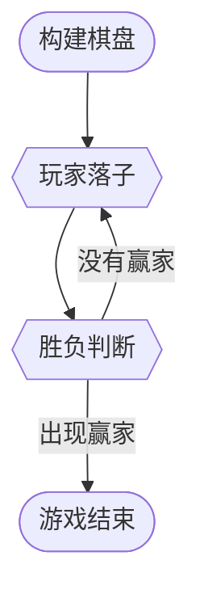

# 侯理想 202311023018
# 指导教师：田佳音


## 一、概述
此项结课作业实现了一个简单的五子棋双人对弈程序。程序设计过程中运用了C++程序设计语言的面向对象的特性，体现了本学期所学习的相关知识。
>**五子棋**，是一种两人对弈的纯策略型棋类游戏，通常双方分别使用黑白两色的棋子，轮流下在棋盘直线与横线的交叉点上，先在横线、直线或斜对角线上形成5子连线者获胜。
> *来自维基百科中文版*

>~~小时候连五子棋都下不赢别人，我太菜了~~

## 二、运行环境
### 硬件环境
- 处理器：AMD Ryzen 7 6800H with Radeon Graphics            3.20 GHz
- 运行内存：16GB DDR4 板载
- 硬盘：512GB M.2 NVMe™ PCIe® 3.0 SSD
- 系统类型：64位操作系统，基于x64处理器
>~~我想升级一下我的笔记本电脑(*^_^*)~~
### 软件环境
- 操作系统：Windows11 家庭中文版本
- 系统版本：22631.3593
- 集成开发环境（IDE）: Dev-C++ 5.11
- 编译器配置：TDM-GCC 4.9.2 64-bit
## 三、功能实现及流程图
### 1.构建棋盘
在初始化操作中，我们构造了一个10×10大小的棋盘并打印出来。为了方便玩家确定横纵坐标，我们还输出了坐标轴的数字。在可供落子的位置我们用星号✳来表示。
### 2.玩家落子
黑白双方轮流落子。玩家只可以在棋盘内标有星号的位置落子，否则系统会提示落子不合法，要求玩家重新选择落子位置。每次落子结束以后，我们都进行一次输赢判断。若无人获胜，则由下一名玩家落子。若有人获胜，则游戏结束。
### 3.胜负判断
每当棋盘上出现一枚新的落子，我们都要进行一次输赢判断。按照五子棋的游戏规则，当一名玩家实现在棋盘上有横、竖、对角线任何一种情况下出现连续五枚棋子，则该玩家获胜。如果没有玩家获胜，则进入落子环节，否则游戏结束。
### 4.游戏结束
如果在胜负判断环节出现赢家，则在控制台窗口中打印胜负信息，宣布游戏结束，并且程序结束。
### 流程图如下

~~好简陋的流程图啊 ,好丑，好丑 ≧ ﹏ ≦~~
## 四、代码实现
### 1.构建棋盘
构建棋盘为初始化操作，我们运用一个无返回值的函数进行实现。代码实现如下：
``` cpp
void Init(){
	//初始化棋盘 ,构造一个简单的10*10大小的棋盘 
	for(int i = 0;i<10;i++)
		for(int j = 0;j<10;j++) Map[i][j] = '*'; 
}
```
Map是一个字符二维数组，用来存储对弈状态。这个初始化函数很简单，只是把字符数组里面每一个元素都修改为星号。
### 2.玩家落子
为黑白双方分别编写一个class类。类中的成员变量x和y确定落子的横纵坐标。成员函数Move()获取键盘的输入信息并实现落子的操作。这里要注意，**为了保证玩家输入的落子合法，我们必须要对玩家落子的位置进行合法性检验。** 网上流传的很多五子棋代码都没有进行这一部分操作，因而产生了bug。（~~好吧，我承认我也借鉴了网上的代码🥲~~）。
代码实现如下：
``` cpp
private:
	int x , y;
public:
	void Move(){
		//黑方开始落子，并判断落子位置是否合法 
		cout << "请输入黑方落子坐标："; 
		cin >> x >> y;
		if(x < 0 || y < 0 || x>9 || y>9) {
			cout << "警告：您的落子不在棋盘内！！！" << endl; 
			Move();
			return ;
		}
		if(Map[x][y] != '*'){
			cout << "警告：此位置已有落子！！！" << endl;
			Move();
			return ; 
		}
		Map[x][y] = 'B';
		Print_Map(); 
	}	
```
>我实在是搞不懂，为什么Markdown会把代码中的!=直接写成不等号，这不是我的错`(*>﹏<*)′
### 3.胜负判断
这一部分操作我也写在了class中，运用一个成员函数进行实现。其实思想很简单，就是五子棋最核心的规则而已。但就是写起来比较麻烦了，我们需要分各种情况进行讨论。
我最初的想法是用搜索的算法遍历整个棋盘，寻找有没有五子连珠的情况。后来想想，其实不必，我们只需要在玩家最后落子的附近进行搜索就可以了。没什么很高深的技巧，只能繁琐地一点点写下去。
代码实现如下：
```cpp
bool Is_Win(){
			//判断输赢情况 
			int tot = 1;
			for(int i = 1;;i++){//判断横线是否满足5个连续黑子 
				int nx = x+i;
				if(nx > 9 || Map[nx][y]=='W') break;
				else if(Map[nx][y]=='B')tot++;
			}
			for(int i = 1;;i++){
				int nx = x-i;
				if(nx < 0 || Map[nx][y]=='W') break;
				else if(Map[nx][y]=='B')tot++;
			}
			if(tot == 5) return true;
			tot = 1;
			for(int i = 1;;i++){//判断纵线是否满足连续5个落子 
				int ny = y+i;
				if(ny > 9 || Map[x][ny]=='W') break;
				else if(Map[x][ny]=='B')tot++;
			}
			for(int i = 1;;i++){
				int ny = y-i;
				if(ny < 0 || Map[x][ny]=='W') break;
				else if(Map[x][ny]=='B')tot++;
			}
			if(tot == 5) return true;
			
			tot = 1;
			for(int i = 1;;i++){//判断对角线是否满足连续5个落子 
				int nx = x+i , ny = y+i;
				if(nx > 9 || ny > 9 || Map[nx][ny]=='W') break;
				else if(Map[nx][ny] == 'B') tot++;
			}
			for(int i = 1;;i++){
				int nx = x-i , ny = y-i;
				if(nx < 0 || ny < 0 || Map[nx][ny]=='W') break;
				else if(Map[nx][ny] == 'B') tot++;
			}
			if(tot == 5) return true;
			
			tot = 1;
			for(int i = 1;;i++){
				int nx = x-i , ny = y+i;
				if(nx < 0 || ny > 9 || Map[nx][ny]=='W') break;
				else if(Map[nx][ny] == 'B') tot++;
			}
			for(int i = 1;;i++){
				int nx = x+i , ny = y-i;
				if(nx > 9 || ny < 0 || Map[nx][ny]=='W') break;
				else if(Map[nx][ny] == 'B') tot++;
			}
			if(tot == 5) return true;
			return false;
		}
```

整个程序里面最冗长的就是这部分。
~~不过正好可以用来水代码长度。~~
### 4.游戏结束
如果我们找到了赢家，那么游戏就结束了，同时我们要打印胜负信息，告诉玩家对弈结果。这部分代码的实现直接写在了主函数里面。
代码实现如下：
```cpp
	while(1){          //游戏不断循环，直到结束 
		B.Move(); //黑方落子 
		if(B.Is_Win()){
			cout << "Winner is Black!";  
			return 0;
		}
		W.Move(); //白方落子 
		if(W.Is_Win()){
			cout << "Winner is White!";  
			return 0;
		}
	}
```
这里我不知道有没有必要修改一下。在while循环里面我直接用了return 0 来结束循环，好像不大优美。如果用break结束循环可能会更好。
### 主函数实现
```cpp
int main(){
	Init();//初始化操作 
	Print_Map();//打印棋盘 
	Black_Player B;
	White_Player W;
	while(1){          //游戏不断循环，直到结束 
		B.Move(); //黑方落子 
		if(B.Is_Win()){
			cout << "Winner is Black!";  
			return 0;
		}
		W.Move(); //白方落子 
		if(W.Is_Win()){
			cout << "Winner is White!";  
			return 0;
		}
	}
	return 0;
} 
```
## 五、改进方向
### 1.有个bug
虽然说我这个程序已经比网上搜索到的五子棋代码bug少很多了。但很容易发现存在着这样一个bug：
无法判断平局！
说实话，我也并没有想到很巧妙的解决这个问题的方法。一种朴素的想法是，在每次落子之后都遍历整个棋盘，看看还有没有空余位置，如果没有可供下一次落子的位置了，那么双方平局。这种操作很质朴，毕竟我们的棋盘不太大，遍历一次也耗费不了很多时间。但过去打比赛的习惯总是让我觉得这种方法太不够”优美“了。
### 2.图形化
C++控制台程序实在太丑了！！！黑乎乎一大片，谁都不乐意看。
EasyX和Qt应该都是实现图形化的好工具。受于时间所限，我自己没能实现这个程序的图形化，希望有时间可以自己学习一下相关知识。
### 3.人机对弈
人机对弈的功能，想想就很高大上。
在我小学的时候就听说过大名鼎鼎的Alpha Go,它以一己之力横扫了整个围棋圈的各路高手，包括我们所熟悉的柯洁大佬。Alpha Go是一个围棋人工智能，围棋的变化比五子棋多得多，它的强大可见一斑了。作为一个菜鸟，没有谷歌公司那么强大的财力智力，也没学习过机器学习的算法，只能大概想一想该怎么实现五子棋的人机对弈。YouTube上面有一个哈佛大学开设的CS50P课程，内容是人工智能的简单入门，示例程序都是用Python写的。这个课程的第一节讲座介绍了深度优先搜索DFS和广度优先搜索BFS的算法，并用这两种算法实现了求解迷宫的问题。我想，五子棋的人机对弈应该也可以使用类似的算法来实现。
>不登泰山，不知天之高也。
>不临深溪，不知地之厚也。
## 六、结语
在高中的时候，我玩过一段时间算法竞赛。不过成绩并不好，到高二就放弃了，也没学到太多东西。那个时候我天真地认为，C和C++唯一的区别就是输入输出的方式不同：C语言用格式化的输入输出函数，C++用输入输出流。到了大学以后，我又参加了算法设计的院级选修课，开始认真地琢磨起了算法。但是，算法竞赛毕竟和工程开发不同，其所运用到的C++语法知识非常少，更多考察的是思维能力。
这学期的C++课上我才第一次接触到面向对象编程的思想，了解到了“抽象”“封装”“继承””多态“等概念的精髓。原来程序还可以这么写！我不由得惊呼道。在课余我自己学习了来自加州大学伯克利分校的CS61a课程，课程的主题是“计算机程序的构造与解释”。在这门课里，我进一步加深了对函数抽象和数据抽象的理解，并且对Python语言有了初步的了解。
这份C++结课作业并不是一个很有创意的选题，可能很多人都在做。但它确实是我自己动手写的第一个有点实际意义的项目。我努力改变原有的把代码都写进主函数里的习惯，尝试编写一个个类和函数分别实现不同的功能。在实际操作中我发现，这种代码风格明显可读性更高了，而且更加易于维护和修改。
C++课程这学期就结束了。这对我们并不是真的结束，而是一个新的开始。计算机科学与技术本就是一个快速发展的学科，我们需要不断提高自己的知识水平，借助计算机的强大力量实现更多的有创意的设计，做出更多有价值的作品。
>西北海之外，大荒之隅，有山而不合，名曰不周。

>学习知识就像不周山，永远不会有『周全』的一天，是为活到老，学到老。


# Lecture 1 排序算法
## 1. 快速排序模板
```cpp
void quicksort(int a[]  , int l , int r){
	int i = l , j = r , flag = a[(l+r)/2] , tmp;
	do{
		while(a[i]<flag) i++;
		while(a[j]>flag) j--;
		if(i <= j){
			tmp = a[i];a[i] = a[j] ;a[j] = tmp;
			i++;j--;
		}
	}while(i<=j);
	if(l < j) quicksort(a,l,j);
	if(i < r) quicksort(a,i,r);
}
```
## 2.STL函数库
例如对a数组排序
```cpp
sort(a+1,a+1+n);
```
>[!tip] 必要时可以为sort()添加第三个参数cmp实现特定方式排序

# Lecture 2 二分
# 第一类二分
在单调递增的数列a中查找≥x的数中最小的一个
``` cpp
while(l<r){
	int mid = (l+r) >> 1;
	if(a[mid] >= x) r = mid; else l = mid + 1;
}
return a[l];
```
## 第二类二分
在单调递增的数列a中查找≤x的数中最大的一个
```cpp
while(l < r){
	int mid = (l+r+1) >> 1;
	if(a[mid] <= x) l = mid;else r = mid-1;
}
return a[l];
```
# Lecture 3 栈和DFS
```cpp

#include<iostream>
using namespace std;
long long a[100+10];
long long b[100 + 10];
bool c[100+10];
bool flag = false;
int cnt = 0;
void f(int cur , int n){
	if(flag) return ;
	if(cur == n+1){
		flag = true;
		for(int i = 1;i<=n;i++){
			cout << b[i] << ' ';
		}
	}
	else{
		bool k = 0;
		for(int i = 1;i<=n;i++){
			if(!c[i] && (a[i]==b[cur-1]*2)){
				k = 1;
				c[i] = 1;
				b[cur] = a[i];
				f(cur+1 , n);
			} 
			if(!c[i] && (a[i]*3==b[cur-1])){
				k = 1;
				c[i] = 1;
				b[cur] = a[i];
				f(cur+1 , n);
			}
			c[i] = 0;
		}
	}
	
}
int main(){
	int n;
	cin >> n ;
	for(int i = 1;i<=n;i++) cin >> a[i];
	for(int i = 1;i<=n;i++){
		b[1] = a[i];
		f(2,n);
	}
	
	//cout << cnt << endl;
	return 0;
}
```
# Lecture 4 队列和BFS
```cpp
#include<iostream>
#include<queue>
using namespace std;
queue <long long> q;
int n;
void BFS(){
	if(q.front()%n == 0){
		cout << q.front() << endl;
		while(!q.empty()){
			q.pop();
		}
	}
	else {
		q.push(q.front()*10);
		q.push(q.front()*10+1);
		q.pop();
		BFS();
	}
} 
int main(){
	while(cin >> n){
		if(n==0) break;
		q.push((long long)1);
		BFS();
	}
	return 0;
}
```

# Lecture 5 动态规划
## 01背包

